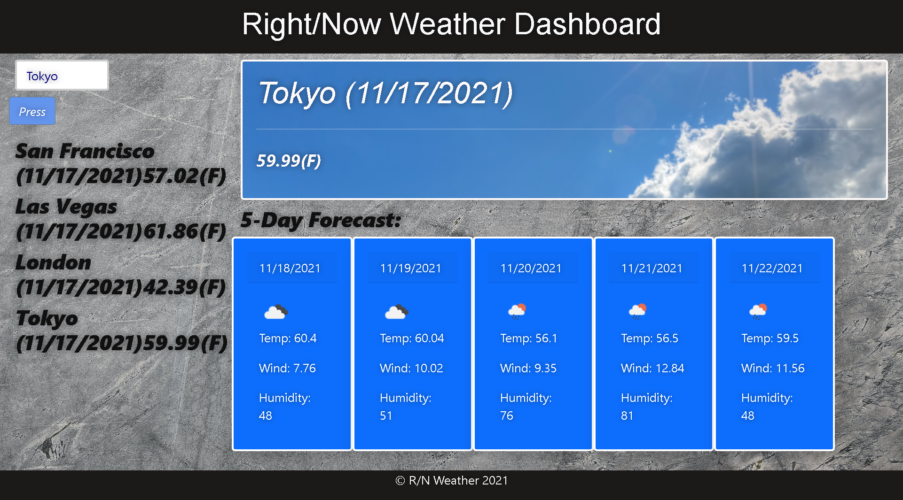

# Right/Now-Weather
 

  

## Table of Contents 

- [Description](#description)
- [Screenshots](#screenshots)
- [Deployed](#deployedapplicationlink)
- [Tools/Languages](#tools/languages)
- [License](#license)
- [Questions](#questions)

 
 

## Description

This is my JavaScript weather dashboard that will run in the browser and feature dynamically updated HTML and CSS.  

 

## Screenshots

    

## Deployed application link

https://tonycodesnow.github.io/Right-Now-Weather/   

## Tools/Languages

JavaScript, Bootstrap, Google Fonts, HTML, CSS, OpenWeather API to retrieve weather data 

## License

  This project is licensed under the MIT license.  

   

## Questions?

If you have any questions, contact me at: 
tony.huertinez@gmail.com   
Check out my other work at GitHUb:
[antoniohuerta](https://github.com/Tonycodesnow)  
